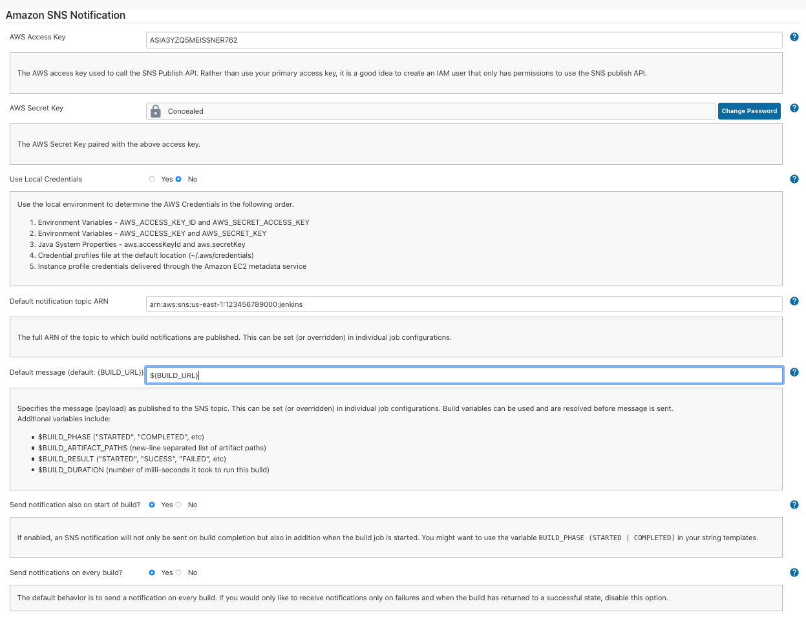
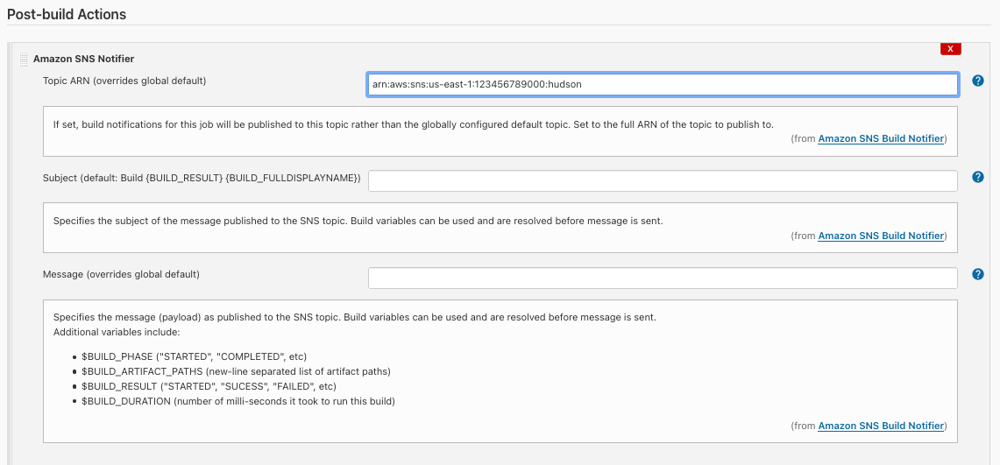

AWS SNS integration Jenkins plugin

#

This plugin integrates the ability of sedating build notification, for both build starting and build ending, with AWS notification service. This way, a cloud-based architecture can be also integrated with a Jenkins engine in order to send notifications which are fully managed by AWS and can be configured from AWS console or infrastructure management tools at any time without affecting the job configuration.

The functionality of the plugin consists in 2 parts, one for plugin management which can be used from only by Jenkins admins from &quot;Manage Jenkins&quot; section, and the second one is the post build action which will trigger the notification service using AWS SDK.

In order to benefit from the full action from this plugin, following actions must be done:

1. Setup the SNS topic, subscribers and create a policy for the topic

To setup a new topic and subscribers please follow the AWS documentation [https://docs.aws.amazon.com/sns/latest/dg/sns-create-subscribe-endpoint-to-topic.html](https://docs.aws.amazon.com/sns/latest/dg/sns-create-subscribe-endpoint-to-topic.html%20)

To setup an account that have limited access only for this topic, you can use the following snippet:

Create the user with programmatic access 

2. Setup the Jenkins plugin using the generated credentials

Manage Jenkins \&gt; Configure Jenkins to use AWS creds and newly created Topic ARN. You can also specify the default bevaiour in case you want to send out also an SNS notification when the build is started (off by default).

The credentials can be stored multiple way, this including:

- Environment Variables - AWS\_ACCESS\_KEY\_ID and AWS\_SECRET\_ACCESS\_KEY
- Environment Variables - AWS\_ACCESS\_KEY and AWS\_SECRET\_KEY
- Java System Properties - aws.accessKeyId and aws.secretKey
- Credential profiles file at the default location (~/.aws/credentials)
- Instance profile credentials delivered through the Amazon EC2 metadata service

As part of your job: add post-build step for SNS notification, optionally configure subject and message (you can make use of build and environment variables, which do get substituted), resp. override Topic ARN (if you do not want to stick with globally configured one).

